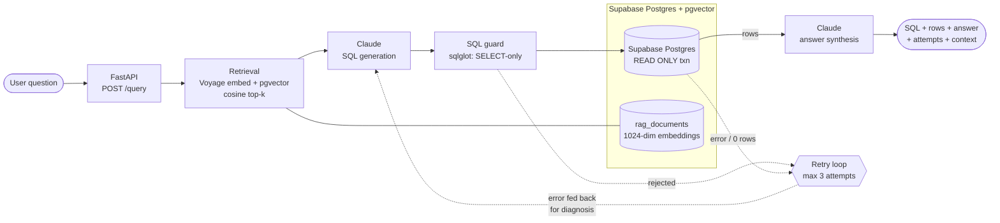

# edgar-nl2sql

Ask a financial question in plain English; get back the SQL that answers it, the rows it
returned, and a grounded natural-language answer — over real SEC EDGAR financial data.

**Live demo:** https://edgar-nl2sql-production-production.up.railway.app/ — ask a question
and watch the retrieval → generation → self-correction pipeline run live.

```
"What was Apple's net margin in fiscal 2023?"
        │
        ▼
POST /query  →  { sql: "SELECT ...", rows: [...], answer: "Apple's net margin in
                  fiscal 2023 was about 25.3% (net income $97.0B / revenue $383.3B).",
                  attempts: [...], context_docs: [...] }
```

It is a small, complete **NL → SQL RAG system** with the operational parts that usually
get skipped in demos: a read-only SQL guard, a self-correcting retry loop, structured
JSON logging with request IDs, an executable golden-set eval that **gates CI**, and a
staged deploy pipeline. The design write-up lives in [ARCHITECTURE.md](ARCHITECTURE.md).

## How it works

1. **Retrieve** — the question is embedded (Voyage AI `voyage-3.5-lite`, 1024 dims) and
   matched via pgvector cosine similarity against a curated corpus of schema docs,
   column notes, and a financial glossary. Retrieval happens **before** generation:
   Claude only ever sees schema context that was fetched for this specific question.
2. **Generate** — Claude writes a single SELECT statement using the retrieved context.
3. **Guard** — the SQL is parsed with sqlglot and rejected unless it is exactly one
   read-only SELECT (no DML/DDL, no system-catalog snooping). Execution additionally
   runs inside a `READ ONLY` transaction with a statement timeout — defense in depth.
4. **Execute & self-correct** — on a guard rejection, execution error, or empty result,
   the error is fed back to Claude to diagnose and regenerate. Max **3 attempts**, then
   the API returns an honest failure explaining what was tried.
5. **Answer** — Claude summarizes the returned rows (and only the returned rows) into a
   short plain-English answer.



## Stack

| Concern | Choice |
|---|---|
| Data + vectors | **Supabase Postgres with pgvector** — relational data and embeddings in one database |
| Embeddings | **Voyage AI `voyage-3.5-lite`** (1024 dimensions) |
| SQL generation & answers | **Claude** (`anthropic` SDK, model configurable via `CLAUDE_MODEL`) |
| API | FastAPI + uvicorn, Python 3.12 |
| SQL validation | sqlglot (Postgres dialect) |
| Logging | structlog, JSON to stdout, request-ID bound |
| Data source | SEC EDGAR XBRL company facts (25 large-cap companies, FY2020–2024) |

## Setup

Prereqs: Python 3.12, a Supabase project (pgvector is available out of the box),
an Anthropic API key, a Voyage AI API key.

```bash
git clone https://github.com/ahdithanu/edgar-nl2sql.git && cd edgar-nl2sql
python3.12 -m venv .venv && source .venv/bin/activate
pip install -e ".[dev]"

cp .env.example .env        # then fill in DATABASE_URL and the API keys

# 1. Create tables + pgvector extension (idempotent)
psql "$DATABASE_URL" -f scripts/schema.sql

# 2. Load SEC EDGAR financials for the 25 tracked companies (idempotent upserts)
python scripts/load_edgar.py

# 3. Embed the schema/glossary corpus into rag_documents
python scripts/build_embeddings.py

# 4. Run the API
uvicorn app.main:app --reload
```

Then open **http://localhost:8000/** — a single-file demo UI that makes the pipeline
observable: the answer, the final SQL, the result rows, a self-correction timeline
(every attempt's SQL, outcome, and the model's diagnosis before each retry), and the
retrieved context docs that were injected into the prompt. No build step, no framework;
it exists so the retry loop can be *seen*, not just read about in JSON.

Or from the terminal:

```bash
curl -s localhost:8000/health

curl -s localhost:8000/query \
  -H 'content-type: application/json' \
  -d '{"question": "What was Apple'\''s revenue in fiscal 2023?"}' | jq
```

## Example queries

- "What was Apple's revenue in fiscal 2023?"
- "Which company had the highest net income in 2024?"
- "What was Microsoft's net margin in fiscal 2023?"
- "Compare Amazon and Walmart revenue for fiscal 2022."
- "How did Nvidia's revenue grow year over year from 2022 to 2024?"
- "What was Tesla's debt ratio at the end of fiscal 2023?"
- "What was Coca-Cola's diluted EPS in Q2 of fiscal 2024?"

Every response includes the `attempts` array (each generated SQL, its outcome, and the
model's correction reasoning on retries) and `context_docs` (what retrieval injected) —
the pipeline shows its work.

## Tests & eval

```bash
pytest -m "not eval"        # unit tests: hermetic, no DB or API keys needed

RUN_EVAL=1 pytest -m eval   # golden-set eval: needs live DB + API keys
```

The eval harness executes each golden question's `reference_sql` for ground truth, runs
the full pipeline (retry loop included), and compares result sets with a 1% numeric
tolerance.

**Current golden-set accuracy: 17/17 = 100%**, reproduced on two consecutive runs
against the live database (2026-07-19).

The CI gate is `EVAL_MIN_ACCURACY=0.85` — deliberately below the measured baseline. The
gate is on **aggregate** accuracy, not per-item: individual misses print full diagnostics
but only the summary test fails the build. An LLM-backed pipeline is nondeterministic, so
failing on any single miss would make the threshold decorative and block deploys on
sampling noise; 85% catches a real regression while tolerating ~2 unlucky rolls of 17.

### Known failure modes

- **Unanswerable questions used to be scored as successes.** Asked something outside the
  data ("rainfall in Mordor"), the model would decline to write SQL, get retried with
  feedback asserting *"the question likely has an answer"*, and satisfy the loop by
  returning prose inside a string literal — `SELECT '<explanation>' AS answer`. One row,
  `success=True`. The eval caught it. Fixed by giving the model an explicit
  `CANNOT_ANSWER:` protocol that terminates the loop honestly (and saves two LLM calls);
  the retry feedback no longer asserts an answer exists. Regression test:
  `tests/test_pipeline.py::test_unanswerable_question_short_circuits_without_retrying`.
- **Fiscal vs. calendar years.** `fiscal_year` is the company's own label — Apple's FY2023
  ends September 2023, not December. Questions phrased in calendar terms may return the
  fiscal-year figure. The glossary corpus warns the model, but phrasing can still slip past.
- **Derived Q4 for flow metrics.** Q4 revenue/net income/EPS are computed as
  `FY − (Q1+Q2+Q3)`, since 10-Ks report the full year rather than a fourth quarter. Exact
  for revenue and net income; approximate for EPS, where share-count changes across
  quarters make the subtraction slightly lossy.
- **Coverage gaps by design.** 25 companies, FY2020–2024, five metrics. Anything else
  (R&D spend, cash flow, headcount, non-US filers) correctly returns a refusal, not a guess.

## Docker

```bash
docker build -t edgar-nl2sql .

docker run --rm -p 8000:8000 --env-file .env edgar-nl2sql
# or with an explicit port:
docker run --rm -e PORT=8080 -p 8080:8080 --env-file .env edgar-nl2sql
```

The image is multi-stage (`python:3.12-slim` runtime, dependencies baked in a builder
stage) and runs as a non-root user.

## Deployment (Railway)

Two services in one Railway project, deployed from the Dockerfile:

| Environment | Service | URL |
|---|---|---|
| Staging | `edgar-nl2sql-staging` | https://edgar-nl2sql-staging-production.up.railway.app |
| Production | `edgar-nl2sql-production` | https://edgar-nl2sql-production-production.up.railway.app |

Each service sets `DATABASE_URL`, `ANTHROPIC_API_KEY`, `VOYAGE_API_KEY`,
`RATE_LIMIT_PER_MINUTE`, and `PORT=8000` (the app honors `$PORT`; pinning it makes the
generated public domain's target port deterministic). The app is stateless — all state
lives in Supabase Postgres — so containers can be replaced freely.

CI (`.github/workflows/ci.yml`) is a trust ladder:

1. **unit** — every push/PR, no secrets required.
2. **eval** — runs when `DATABASE_URL`, `ANTHROPIC_API_KEY`, and `VOYAGE_API_KEY`
   secrets are configured; gates on golden-set accuracy.
3. **deploy-staging** — on push to `main`, only after unit + eval are green, deploys to
   the Railway **staging** service via `railway up` (requires the `RAILWAY_TOKEN`
   secret; skipped gracefully when absent).

### Staging → production promotion

Production deploys are deliberately manual — a human looks at staging first:

1. CI deploys `main` to the `edgar-nl2sql-staging` service automatically.
2. Smoke-check staging: `GET /health` returns `ok`, and a couple of the example
   queries above return sensible SQL + answers.
3. Promote the same commit to production:
   ```bash
   railway up --service edgar-nl2sql-production --detach
   ```
   (run locally with `RAILWAY_TOKEN` set, or redeploy the staging image from the
   Railway dashboard onto the production service).

### Rollback

Railway keeps previous deployments per service:

1. Open the production service in the Railway dashboard → **Deployments**.
2. Pick the last known-good deployment → **Redeploy**. This reverts the running code
   without touching the database (the app is stateless; schema changes are additive
   and idempotent by design).
3. Equivalent CLI: `railway redeploy --service edgar-nl2sql-production` after checking
   out the known-good commit, or `railway down` to stop a bad deploy immediately.

## Repo map

```
app/            FastAPI service: config, models, db, retrieval, generation,
                sql_guard, pipeline (the retry loop lives here), main
scripts/        schema.sql, load_edgar.py (SEC EDGAR loader),
                context_docs.py + build_embeddings.py (RAG corpus)
tests/          hermetic unit tests (mocked LLM/DB)
eval/           golden_set.yaml + eval harness (live, accuracy-gated)
ARCHITECTURE.md design decisions and trade-offs, in plain English
```
